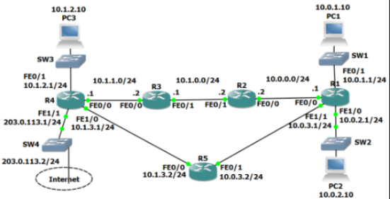
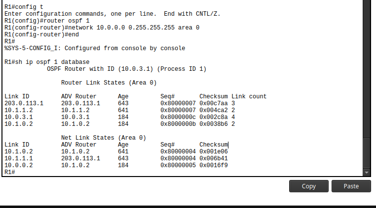
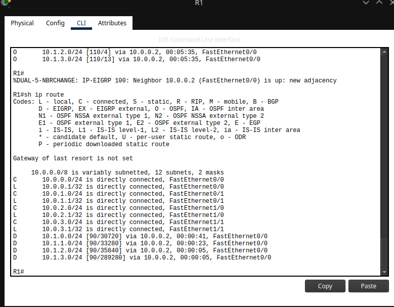

# Cisco Dynamic Routing Protocols Lab – Flackbox Lab 17

**Completed:** November 19, 2025  
**Author:** Ruben Tot (@rubentot)  
**Tools:** Cisco Packet Tracer 8.2  
**Source:** Flackbox / Neil Anderson (one of the best routing labs ever made)

https://github.com/rubentot/dynamic-routing-protocols-lab

This lab perfectly shows why RIP is obsolete and why real networks use OSPF/EIGRP instead.

Key concepts demonstrated:
- Equal-cost vs unequal-cost load balancing
- Administrative distance determining route preference
- Hop-count vs bandwidth-based vs composite metrics
- Redistribution via AD manipulation (senior-level technique)
- Passive interfaces & adjacency control
- Loopback advertisement
- Link-state database vs distance-vector table



## Real-World IGP Usage (2025)

| Rank | Protocol   | Where it's actually used                  | Why |
|------|------------|-------------------------------------------|-----|
| 1    | BGP (EVPN) | Cloud, DC fabric, service provider core   | Scale + flexibility |
| 2    | OSPF       | Most new enterprise/multi-vendor networks | Open standard, reliable |
| 3    | EIGRP      | Pure Cisco enterprise (still massive)     | Fastest convergence + unequal-cost LB |
| 4    | IS-IS      | SPs, large cores, modern campuses         | Slightly better than OSPF for MPLS/SR |
| 5    | Static     | Edge/default routes                       | Always needed |
| 69   | RIP        | Only CCNA labs & ancient branches         | Hop-count only, slow, noisy |

## Core Configurations (All Routers)


! RIP v2
router rip
 version 2
 no auto-summary
 network 10.0.0.0

! OSPF
router ospf 1
 network 10.0.0.0 0.255.255.255 area 0

! EIGRP
router eigrp 100
 no auto-summary
 network 10.0.0.0 0.255.255.255

 Question Highlights & Answers
RIP Section

Q2 → Broadcast (255.255.255.255)
Q4 → Multicast (224.0.0.9)
Q7 → Two routes to 10.1.1.0/24 → equal-cost load balancing (both paths = 2 hops)

OSPF Section

Q10 → No, RIP routes gone → OSPF AD 110 < RIP AD 120
Q11 → Only one route → OSPF uses bandwidth-based cost (serial links = cost ~647, top path = cost 2)
Q12-14 → Shut R2 Fa0/0 → route switches to R5, cost jumps to ~648
Q15 → OSPF database = full topology map. RIP database = just routes/metrics → link-state vs distance-vector

OSPF Link-State Database (Q15)


Back to RIP (after removing OSPF)

Q17 → Yes, via R5
Q18 → Metric 2
Q19 → Only one route (path preference changes based on current state)
Q20 → Ensure both paths up → RIP reinstalls both equal-cost routes

EIGRP Section

Q22-23 → EIGRP routes replace everything (AD 90 wins)
Q24-25 → Only one route → EIGRP correctly avoids serial link (huge delay in composite metric)

OSPF Cost-Based Path Selection (only one route to 10.1.1.0/24)


Q27 – The Money Question (6 commands total)

Goal: Prefer fast top path while up, automatic failover to R5 path when R1-R2 link dies — without enabling EIGRP on R5.

EIGRP Composite Metric Wins (AD 90, lowest actual bandwidth/delay)


The pro solution (real-world migration technique):

On R1, R2, R3, R4 only:
```bash
router rip
 distance 80

Loopbacks 192.168.0.x/32 need explicit network statement in EIGRP
Passive-interface stops hellos → breaks adjacency → forces suboptimal path
